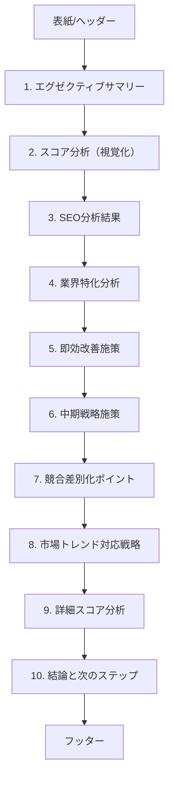

### 完成予定のテキスト構成（PDF/レポート）

概要: 生成されるPDFレポートの章立てと主要要素の構成を定義します。UIの表示順も同等です。

- 表紙/ヘッダー
  - タイトル（アプリ名/バージョン）
  - 生成日時
  - 任意のロゴ

- 1. エグゼクティブサマリー
  - 対象URL、業界判定（根拠/信頼度）
  - 総合スコア、SEOスコア、AIOスコア
  - 主要改善領域（上位3件）
  - スコア整合性チェック（reported vs expected/observed, Δ表示）

- 2. スコア分析（視覚化）
  - SEOスコア分布（棒グラフ）
  - AIOスコア分布（棒グラフ）

- 3. SEO分析結果
  - タイトル/ディスクリプション（文字数、文字化け警告）
  - 構造（見出し/リンク/画像Alt）
  - 技術要素（構造化データ/viewport/ページサイズ）

- 4. 業界特化分析
  - 業界適合度、トレンド、特化改善、規制対応

- 5. 即効改善施策（1-2週間）
  - 施策 / 実装方法 / 期待効果（箇条書き）

- 6. 中期戦略施策（1-3ヶ月）
  - 戦略 / 期間 / 期待成果（箇条書き）

- 7. 競合差別化ポイント
  - 差別化ポイント / 実装方法（箇条書き）

- 8. 市場トレンド対応戦略
  - トレンド / 戦略 / 優先度（箇条書き）

- 9. 詳細スコア分析
  - AIO上位8項目（E-E-A-T/AI最適化）: スコア/助言
  - AIO下位8項目（UX/技術）: スコア/助言

- 10. 結論と次のステップ
  - 優先アクション一覧（箇条書き）
  - 再分析の推奨

- フッター
  - 生成アプリ名/バージョン、注記

---

注:
- スコア整合性チェックはB章（サマリー）に掲載。
- グラフはPNGとして一時生成し、レポートに埋め込みます。

